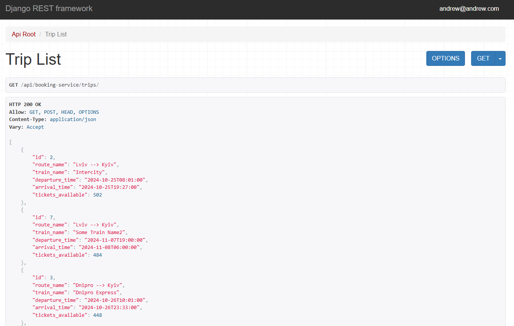

# Train Booking API Service


App for searching train routes an booking tickets.

## Mission
This completely useless for commercial use project was created to train in the development of api application based on Django and to blow the minds of my mentors.

The second goal of this project is to demonstrate to future employers that I am capable of writing something more significant than just 'Hello, world'.

## Technology Stack

- **Backend:** Python 3.12.7, Django 4.x, Django REST Framework
- **Database:** PostgreSQL
- **Testing:** Django Test Framework
- **Others:** JWT, Docker, Click, Pillow, PyYAML, psycopg2, pyflakes, pytz

## Description

This app created to make life easier when yon traveling by train.

In this app you can:
- find train route by departure and/or arrival station
- also by departure time - you can see trains on exaxcly time and later
- in wich route will be information about amount of free seats
- You can find some photos of staitions


## Getting Started

These instructions will get you a copy of the project up and running on your local machine for development and testing purposes.

### Prerequisites

Must have:
- a computer with some operating system 
- some free time

### System Requirements

- Python 3.10
- pip (Python package installer)
- Docker


### Installing

A step by step series of examples that tell you how to get a development env running

1. Clone the repository:
    ```
    git clone the-link-from-forked-repo
    ```
2. Open the project folder in your IDE
3. Copy settings from .env.example to .env and set values
4. If you are using PyCharm - it may propose you to automatically create venv for your project and install requirements in it, but if not:
    ```
    python -m venv venv
    venv\Scripts\activate (on Windows)
    source venv/bin/activate (on macOS)
    pip install -r requirements.txt
    ```
4. Use .env.example for settingns

5. Build docker image and run the app with PostgerSQL .
    ```
    docker-compose build
    docker-compose up
   ```
    After starting the server, the interface is available at: `http://127.0.0.1:8001`.

6. For creating superuser:
    ```
    docker ps
    docker exec -it <continer name> bash
    python manage.py createsuperuser
    ```

7. You can use  train_booking_data.json for testing app.
    ```
    docker ps
    docker exec -it <continer name> bash
    python manage.py loaddata train_booking_data.json
    ```

8. After loading data from fixture you can use following superuser (or create another one by yourself):
  - email: `andrew@andrew.com`
  - Password: `andrew`

9. If you want use app like user:
    1. Register in app:
        ```
        /api/user/register/
        ```
    2. Get your token:
         ```
        /api/user/token/
        ```


## API Endpoints

Major endpoints for interacting with the application:

    Booking service:
      - `/api/booking-service/crew/` - Manage staff.
      - `/api/booking-service/stations/` - Manage stations and their images.
      - `/api/booking-service/trains/` - Manage trains.
      - `/api/booking-service/train_types/` - Manage train types.
      - `/api/booking-service/routes/` - Manage train routes.
      - `/api/booking-service/trips/` - Manage trips, search by source, destination, time.
      - `/api/booking-service/orders/` - Manage orders and tickets (you can see only yours orders).
  
    User:
      - `/api/user/register/` - Register a new user .
      - `/api/booking-service/stations/` - Manage stations and their images.
      - `/api/user/token/` - Obtain token pair.
      - `/api/user/token/refresh/` - Actualize your access token with refresh token .
      - `/api/user/token/verify/` - Verify token if it is valid.
      - `api/user/me/` - Manage your profile details.
      
### Swagger API

- `/api/doc/swagger/`

### Redoc API

- `/api/doc/redoc/`

### DB Structure:


### API screehsots:





